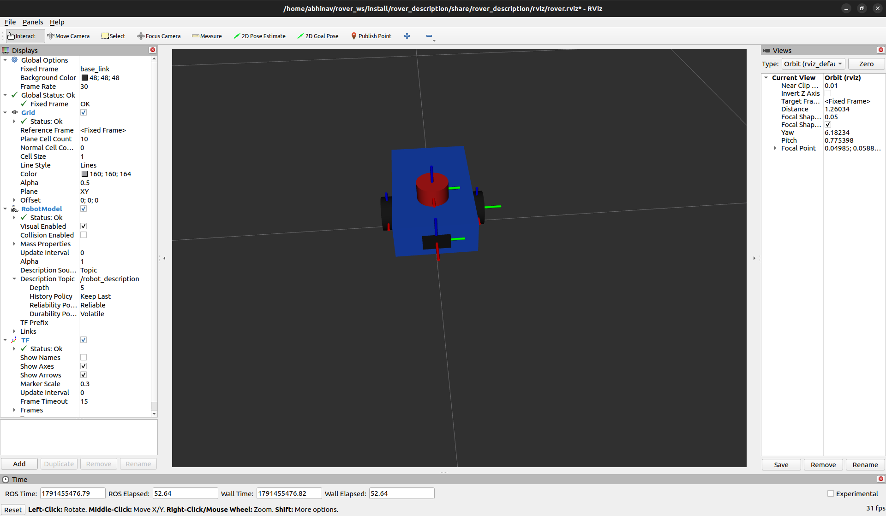

# Rover: ROS 2 Differential-Drive Robot Model

A differential-drive rover described in URDF/Xacro and visualized in RViz2, built with ROS 2 Humble.



## Features

- Parametric Xacro model (dimensions and masses defined as variables)
- Reusable wheel macro, used for both drive wheels
- Chassis, two continuous-joint wheels, rear caster, lidar and camera frames
- Visual, collision and inertial properties on the body and wheels
- One launch file that starts `robot_state_publisher`, a joint slider GUI and a preconfigured RViz2

## Robot structure

```
base_link
 ├── wheel_left   (continuous joint)
 ├── wheel_right  (continuous joint)
 ├── caster       (fixed joint)
 ├── lidar_link   (fixed joint)
 └── camera_link  (fixed joint)
```

## Requirements

- Ubuntu 22.04
- ROS 2 Humble
- `ros-humble-joint-state-publisher-gui`, `ros-humble-xacro`, `ros-humble-rviz2`

## Build and run

```bash
git clone https://github.com/abhinav-006/rover_ws.git
cd rover_ws
source /opt/ros/humble/setup.bash
colcon build --symlink-install
source install/setup.bash
ros2 launch rover_description display.launch.py
```

Drag the sliders in the Joint State Publisher window to rotate each wheel.

## Roadmap

- [ ] Simulate the rover in Gazebo with a differential-drive plugin
- [ ] Add lidar and camera sensor plugins
- [ ] Obstacle avoidance node
- [ ] SLAM with slam_toolbox
- [ ] Autonomous navigation with Nav2

## Author

Abhinav Bhandari